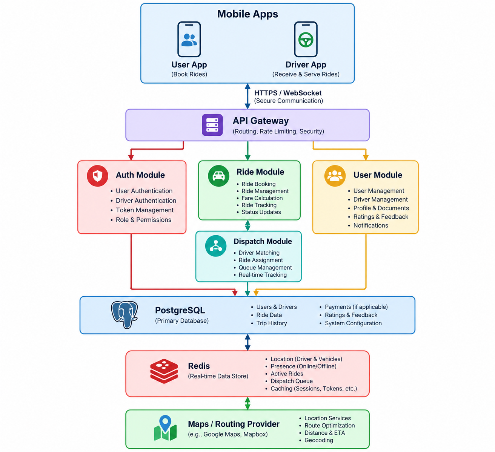

# SevaRath - Brahma Kumaris Internal EV Booking System

## 1. Purpose

Build an internal EV transportation application for use within the Shantivan and nearby premises.

The application provides a simple Uber-like experience for:

* Requesting an EV ride
* Matching a request with an available driver
* Driver accepting or rejecting a request
* Real-time driver/user location
* Pickup and destination selection
* Map display
* Navigation directions
* Ride status tracking
* Ride completion
* Basic ride history

There is **no payment, fare calculation, surge pricing, wallet, or commercial transaction**.

The system is intended for controlled internal use within the headquarters premises.

---

# 2. Initial Product Scope

The first fully working release should contain two mobile applications/interfaces:

### User App

A person who wants transportation can:

1. Sign in
2. View current location
3. Select pickup location
4. Select destination
5. Request an EV
6. See request status
7. See assigned vehicle/driver
8. Track the EV on a map
9. View navigation/progress
10. Cancel the request when permitted
11. Complete the trip
12. View ride history

### Driver App

A driver can:

1. Sign in
2. Go online/offline
3. Share current location
4. Receive ride requests
5. Accept/reject requests
6. Navigate to pickup
7. Start the ride
8. Navigate to destination
9. Complete the ride
10. View previous rides

### Admin

An initial lightweight admin interface should provide:

* Driver management
* User management
* EV/vehicle management
* Driver-to-vehicle assignment
* Driver availability
* Active rides
* Ride history
* Basic operational dashboard

The admin interface does not need to be part of the first mobile release.

---

# 3. Product Philosophy

The system should be designed around the actual headquarters environment rather than attempting to reproduce Uber.

The initial system should deliberately avoid:

* Payments
* Fare calculation
* Driver ratings
* Tips
* Promotions
* Surge pricing
* Public driver registration
* Complex driver incentives
* Multi-city support
* Customer support marketplace
* Dynamic pricing
* Advanced dispatch optimization

The primary workflow is:

```text
User
  |
  | Request EV
  v
Ride Request
  |
  v
Find Available Driver
  |
  v
Driver receives request
  |
  | Accept
  v
Ride Assigned
  |
  v
Driver navigates to pickup
  |
  v
Ride Started
  |
  v
Driver navigates to destination
  |
  v
Ride Completed
```

---

# 4. Recommended Architecture

Use a modular backend rather than a large microservice architecture for the first version.

Recommended:

```text
                         +----------------------+
                         |      Mobile Apps     |
                         |----------------------|
                         | User App             |
                         | Driver App           |
                         +----------+-----------+
                                    |
                              HTTPS / WebSocket
                                    |
                                    v
                         +----------------------+
                         |     API Gateway      |
                         +----------+-----------+
                                    |
             +----------------------+----------------------+
             |                      |                      |
             v                      v                      v
      +-------------+        +-------------+        +-------------+
      | Auth Module |        | Ride Module |        | User Module |
      +-------------+        +-------------+        +-------------+
             |                      |
             |                      v
             |              +---------------+
             |              | Dispatch      |
             |              | Module        |
             |              +---------------+
             |                      |
             v                      v
      +------------------------------------------------------+
      |                  PostgreSQL                          |
      +------------------------------------------------------+
                                    |
                                    v
                          +-------------------+
                          | Redis             |
                          |                   |
                          | Location          |
                          | Presence          |
                          | Active rides      |
                          | Queue             |
                          +-------------------+

                                    |
                                    v

                         +----------------------+
                         | Maps / Routing       |
                         | Provider             |
                         +----------------------+
```

---

# 5. Recommended Technology Stack

The following stack is recommended for the first implementation.

## Mobile

Prefer:

```text
React Native
```

or:

```text
Flutter
```

If the development team already has strong React/TypeScript expertise, use:

```text
React Native + TypeScript
```

This allows the user and driver applications to share:

* UI components
* API client
* authentication
* domain models
* location utilities
* WebSocket client
* map components

A monorepo can be used:

```text
apps/
  user-app/
  driver-app/
  admin-app/

packages/
  api-client/
  domain/
  ui/
  location/
  config/
```

---

# 6. Backend

Recommended:

```text
NestJS
TypeScript
PostgreSQL
Redis
WebSocket
```

NestJS is particularly suitable because the system needs:

* REST APIs
* WebSockets
* authentication
* background processing
* scheduled jobs
* modular domain architecture

Initial backend:

```text
ev-platform-api
```

Do NOT create separate microservices for every module initially.

Use a modular monolith:

```text
src/

  auth/
  users/
  drivers/
  vehicles/
  rides/
  dispatch/
  locations/
  notifications/
  maps/
  admin/
```

The modules should have clean boundaries so they can later be extracted into services if required.

---

# 7. Database

Use PostgreSQL as the source of truth.

Recommended extensions:

```text
PostGIS
```

PostGIS is useful for:

* geographic coordinates
* distance calculations
* nearest-driver queries
* campus geofencing
* pickup/destination locations

Example:

```text
users
drivers
vehicles
rides
ride_events
driver_locations
notifications
campus_locations
```

---

# 8. Redis

Redis should be used for highly dynamic information rather than permanent business data.

Use Redis for:

* Driver online/offline status
* Driver current location
* Active ride state
* Driver availability
* WebSocket presence
* Dispatch locking
* Temporary ride-request state
* Rate limiting
* Pub/Sub if required

Example:

```text
driver:{driverId}:location
driver:{driverId}:status
ride:{rideId}:state
ride:{rideId}:drivers
```

PostgreSQL remains the authoritative source for ride history and business data.

---

# 9. Real-Time Communication

Use WebSockets.

NestJS WebSocket Gateway can provide:

```text
/user
/driver
/ride
```

Example events:

### User

```text
ride.requested
ride.searching
ride.driver_assigned
driver.location_updated
ride.driver_arrived
ride.started
ride.completed
ride.cancelled
```

### Driver

```text
ride.request
ride.cancelled
ride.updated
```

### Driver location

```text
driver.location
```

The driver app should periodically send location updates.

For example:

```text
Every 3-5 seconds while driving
Every 10-15 seconds when stationary
```

The exact frequency should be tuned after testing.

---

# 10. Ride State Machine

The ride lifecycle should be explicitly modeled.

```text
REQUESTED
    |
    v
SEARCHING_DRIVER
    |
    v
DRIVER_ASSIGNED
    |
    v
DRIVER_EN_ROUTE_TO_PICKUP
    |
    v
DRIVER_ARRIVED
    |
    v
RIDE_STARTED
    |
    v
DRIVER_EN_ROUTE_TO_DESTINATION
    |
    v
COMPLETED
```

Alternative terminal states:

```text
CANCELLED_BY_USER
CANCELLED_BY_DRIVER
CANCELLED_BY_SYSTEM
NO_DRIVER_AVAILABLE
```

Never allow arbitrary status updates.

All status transitions must be validated by the backend.

---

# 11. Ride Request Flow

## Step 1 - User selects pickup

The user can:

* Use current GPS location
* Select a location on the map
* Select a predefined campus location

Example:

```text
Pickup:
Main Gate

Destination:
Shantivan Reception
```

---

## Step 2 - User requests EV

API:

```http
POST /rides
```

Example:

```json
{
  "pickup": {
    "latitude": 23.123,
    "longitude": 72.123
  },
  "destination": {
    "latitude": 23.124,
    "longitude": 72.124
  }
}
```

Backend:

```text
Create ride
      |
      v
SEARCHING_DRIVER
      |
      v
Find available drivers
      |
      v
Send request
```

---

# 12. Driver Matching

The first version should use a simple nearest-available-driver algorithm.

Example:

```text
1. Find online drivers
2. Filter available drivers
3. Filter drivers inside campus/geofence
4. Calculate distance from pickup
5. Sort by distance
6. Send request to closest driver
```

Do not build an advanced dispatch algorithm initially.

---

# 13. Driver Acceptance

The driver receives:

```text
New Ride Request

Pickup:
Main Gate

Destination:
Shantivan

Distance:
850 m

[ ACCEPT ] [ REJECT ]
```

The driver has a limited time to respond.

For example:

```text
15 seconds
```

If rejected or timed out:

```text
Select next available driver
```

Backend must use an atomic operation/Redis lock to prevent two drivers from accepting the same ride.

---

# 14. Important Concurrency Rule

The following must never happen:

```text
Driver A -> Accept
Driver B -> Accept
             |
             v
Same ride assigned to both
```

Use server-side transactional/atomic assignment.

Example conceptual operation:

```text
if ride.status == SEARCHING_DRIVER
    assign driver
    change status to DRIVER_ASSIGNED
else
    reject assignment
```

This must happen on the backend, not in the mobile application.

---

# 15. Location Architecture

Location is one of the most important parts of this system.

### Driver

The driver application periodically sends:

```text
latitude
longitude
heading
speed
accuracy
timestamp
```

Backend stores:

```text
Current location -> Redis
Historical location -> PostgreSQL, optionally
```

Do not write every GPS update directly to PostgreSQL.

Example:

```text
Driver GPS
    |
    v
Driver App
    |
    v
WebSocket
    |
    v
Location Service
    |
    +----> Redis current position
    |
    +----> WebSocket -> User App
```

---

# 16. Location Accuracy

GPS can be inaccurate inside buildings.

The UI should display location accuracy appropriately.

Do not assume:

```text
GPS coordinate = exact vehicle position
```

The system should capture:

```text
accuracy
timestamp
```

and ignore obviously stale or invalid updates.

Example:

```text
accuracy > 100m
```

may be considered low-quality depending on the campus environment.

---

# 17. Maps

The map layer should be abstracted.

Create:

```text
MapProvider
RoutingProvider
GeocodingProvider
```

instead of coupling the entire application directly to Google Maps.

Example:

```typescript
interface MapProvider {
  getRoute(
    origin: Coordinates,
    destination: Coordinates
  ): Promise<Route>;
}
```

This makes it possible to change providers later.

---

# 18. Mapping Provider Options

Possible providers include:

### Google Maps

Advantages:

* Excellent routing
* Strong mobile SDKs
* Good map coverage
* Familiar UX

Disadvantage:

* Usage-based pricing

### OpenStreetMap ecosystem

Possible components:

```text
OpenStreetMap
MapLibre
OSRM
GraphHopper
Valhalla
```

This can reduce dependency on commercial mapping APIs but requires more infrastructure/operations.

For a controlled headquarters environment, an OpenStreetMap-based solution should be considered seriously, especially if the campus has custom internal roads and paths.

---

# 19. Campus Map

A major enhancement should be a dedicated campus map.

Instead of relying entirely on generic road maps, maintain:

```text
Campus buildings
Gates
Parking
EV stops
Important locations
Restricted roads
Pickup points
Drop points
```

Example:

```text
campus_locations

id
name
type
latitude
longitude
description
is_active
```

Types:

```text
GATE
BUILDING
OFFICE
RESIDENCE
DINING
PARKING
EV_STOP
MEDICAL
RECEPTION
OTHER
```

Users can select these locations directly.

This will make the application much easier to use than manually selecting GPS coordinates.

---

# 20. Navigation

Navigation should initially be implemented as:

```text
Route displayed on map
+
Turn-by-turn navigation using map provider
```

The system should not initially attempt to build its own navigation engine.

Example:

```text
Pickup
  |
  | Route
  v
Driver

Destination
  |
  | Route
  v
Vehicle
```

The application can optionally open the device's native navigation application.

Later, in-app navigation can be added.

---

# 21. Authentication

Because this is an internal application, authentication should be controlled.

Possible options:

```text
Mobile number + OTP
```

or, if the organization already has an identity provider:

```text
OIDC / OAuth2
```

Recommended backend model:

```text
User
Driver
Admin
Operator
```

with role-based access control.

Example:

```text
USER
DRIVER
ADMIN
OPERATOR
```

---

# 22. Driver Verification

Drivers should not self-register as trusted drivers.

Driver records should be created/approved by an administrator.

Example:

```text
Driver
------
Name
Employee/Volunteer ID
Mobile
Photo
Status
Assigned Vehicle
Active
```

Driver status:

```text
PENDING
ACTIVE
SUSPENDED
INACTIVE
```

---

# 23. Vehicle Management

Vehicle model:

```text
Vehicle
-------
id
registrationNumber
vehicleNumber
name
type
capacity
status
assignedDriverId
```

Status:

```text
AVAILABLE
IN_SERVICE
MAINTENANCE
INACTIVE
```

The system should support vehicles without requiring public registration numbers if the campus identifies vehicles using internal numbers.

Example:

```text
EV-01
EV-02
EV-03
```

---

# 24. Driver Availability

Driver status should be separate from ride status.

Example:

```text
OFFLINE
AVAILABLE
BUSY
ON_BREAK
```

State transition:

```text
OFFLINE
   |
   v
AVAILABLE
   |
   v
BUSY
   |
   v
AVAILABLE
```

A driver must not receive a new ride while:

```text
BUSY
```

---

# 25. Notifications

Use push notifications for important events.

Examples:

### User

```text
Your EV request has been accepted.
EV-03 is arriving.
Your driver has arrived.
Your ride has started.
Your ride is completed.
```

### Driver

```text
New ride request.
User cancelled the ride.
Ride destination updated.
```

WebSocket should be the primary real-time channel while the application is active.

Push notifications handle background/killed application scenarios.

---

# 26. Suggested Backend Modules

```text
src/

├── auth/
│   ├── auth.controller.ts
│   ├── auth.service.ts
│   └── guards/
│
├── users/
│
├── drivers/
│
├── vehicles/
│
├── rides/
│   ├── rides.controller.ts
│   ├── rides.service.ts
│   ├── ride-state-machine.ts
│   └── dto/
│
├── dispatch/
│   ├── dispatch.service.ts
│   ├── driver-matcher.service.ts
│   └── assignment.service.ts
│
├── locations/
│   ├── location.gateway.ts
│   ├── location.service.ts
│   └── location-cache.service.ts
│
├── notifications/
│
├── maps/
│   ├── map-provider.interface.ts
│   ├── routing-provider.interface.ts
│   └── providers/
│
├── campus/
│
├── admin/
│
└── common/
```

---

# 27. Database Model

Initial entities:

```text
users
drivers
vehicles
rides
ride_events
campus_locations
```

Potential schema:

```text
users
-----
id
name
mobile
email
role
status
created_at
updated_at
```

```text
drivers
-------
id
user_id
driver_code
status
current_vehicle_id
created_at
updated_at
```

```text
vehicles
--------
id
vehicle_code
registration_number
vehicle_type
capacity
status
created_at
updated_at
```

```text
rides
-----
id
user_id
driver_id
vehicle_id

pickup_latitude
pickup_longitude
pickup_location_name

destination_latitude
destination_longitude
destination_location_name

status

requested_at
accepted_at
driver_arrived_at
started_at
completed_at
cancelled_at

created_at
updated_at
```

```text
ride_events
-----------
id
ride_id
event_type
actor_type
actor_id
metadata
created_at
```

The `ride_events` table is particularly useful for debugging and auditing.

---

# 28. Ride Event Audit

Every important state transition should generate an event.

Example:

```text
RIDE_REQUESTED
DRIVER_SEARCH_STARTED
DRIVER_REQUESTED
DRIVER_REJECTED
DRIVER_ASSIGNED
DRIVER_ARRIVED
RIDE_STARTED
RIDE_COMPLETED
USER_CANCELLED
DRIVER_CANCELLED
```

This creates an audit trail.

It will also make troubleshooting much easier.

---

# 29. API Design

Example APIs:

## Authentication

```http
POST /auth/login
POST /auth/verify
POST /auth/refresh
```

## Users

```http
GET /users/me
```

## Drivers

```http
POST /drivers/status
GET /drivers/me
POST /drivers/location
```

## Vehicles

```http
GET /vehicles
GET /vehicles/:id
```

## Rides

```http
POST /rides
GET /rides/:id
POST /rides/:id/cancel
POST /rides/:id/accept
POST /rides/:id/reject
POST /rides/:id/arrived
POST /rides/:id/start
POST /rides/:id/complete
GET /rides/history
```

## Campus

```http
GET /campus/locations
GET /campus/locations/:id
```

---

# 30. WebSocket Events

Example namespace:

```text
/ws
```

Events:

```text
ride.requested
ride.updated
ride.assigned
ride.cancelled

driver.location
driver.status

user.location

ride.driver_location
```

The backend should determine which users are allowed to receive which events.

Do not broadcast all driver locations to all users.

---

# 31. Security

Even though this is an internal application, location data is sensitive.

Implement:

* HTTPS
* JWT/OIDC authentication
* RBAC
* Server-side authorization
* Input validation
* Rate limiting
* Secure WebSocket authentication
* Audit logging
* Token expiration
* Refresh token rotation if applicable

A user should only be able to see:

```text
Their own ride
Their assigned driver's location
```

A driver should only see:

```text
Their assigned rides
Relevant passenger information
```

Administrators can access operational data according to their role.

---

# 32. Location Privacy

Do not permanently store high-frequency location history unless there is a legitimate operational requirement.

Recommended:

```text
Current driver location
        |
        v
Redis
        |
        v
Expire automatically
```

Historical location should only be retained if required for:

* operational analysis
* safety
* incident investigation
* system debugging

Define a retention policy before implementation.

---

# 33. Geofencing

The headquarters should have a defined geographic boundary.

Example:

```text
Campus Geofence
```

The system can use this to:

* Prevent requests outside the campus
* Identify drivers inside the campus
* Prevent accidental dispatch to distant drivers
* Identify when a driver leaves the campus
* Support future campus-specific routing

For the first release, geofencing can be implemented as a simple polygon or radius.

PostGIS is useful here.

---

# 34. Offline Handling

The driver application should tolerate temporary network loss.

For example:

```text
Driver driving
     |
     v
Network lost
     |
     v
Continue showing current ride
     |
     v
Store latest location locally
     |
     v
Network restored
     |
     v
Synchronize
```

However, ride state transitions must ultimately be confirmed by the server.

The driver app must not assume:

```text
"Ride started successfully"
```

until the backend confirms it.

---

# 35. Backend Reliability

The backend must be authoritative.

For example:

```text
Mobile App
    |
    | START RIDE
    v
Backend
    |
    | validate:
    | - correct driver?
    | - correct ride?
    | - correct state?
    |
    v
PostgreSQL
    |
    v
RIDE_STARTED
```

Never rely exclusively on client-side state.

---

# 36. Initial Deployment

For the first production deployment:

```text
                Internet / Campus Network
                         |
                         v
                   Reverse Proxy
                         |
                         v
                  NestJS API
                    /       \
                   /         \
                  v           v
            PostgreSQL       Redis
```

Mobile clients connect through HTTPS/WSS.

Possible deployment:

```text
Docker
+
Kubernetes
```

or a simpler:

```text
Docker Compose
```

if the headquarters infrastructure does not require Kubernetes.

The architecture should remain container-ready.

---

# 37. Observability

Implement from the beginning:

```text
Structured JSON logging
Metrics
Health checks
Error tracking
```

Recommended metrics:

```text
ride_requests_total
ride_completed_total
ride_cancelled_total
ride_assignment_duration_seconds
active_rides
available_drivers
driver_location_updates_total
websocket_connections
push_notifications_total
```

Health endpoints:

```http
GET /health
GET /health/ready
GET /health/live
```

---

# 38. Operational Dashboard

The admin application should eventually show:

```text
+---------------------------------------+
| EV Operations                         |
+---------------------------------------+
| Available EVs       8                 |
| Busy EVs            4                 |
| Offline EVs         2                 |
| Active Requests     3                 |
+---------------------------------------+

             Campus Map

       EV-01       EV-03
          \         /
           \       /
          EV-05  EV-07

Active Requests
-----------------------------------------
REQ-102   Searching
REQ-103   Driver Assigned
REQ-104   Ride Started
```

This will be extremely useful for the transport/operations team.

---

# 39. MVP Development Phases

## Phase 1 - Foundation

Implement:

* Repository
* CI/CD
* NestJS backend
* PostgreSQL
* Redis
* Authentication
* User/driver roles
* Docker environment
* Basic logging

Deliverable:

```text
User can authenticate
Driver can authenticate
```

---

## Phase 2 - Driver Management

Implement:

* Driver profile
* Vehicle management
* Driver status
* Vehicle assignment
* Driver online/offline

Deliverable:

```text
Driver can go ONLINE
Driver can go OFFLINE
```

---

## Phase 3 - Campus Map

Implement:

* Map provider
* Campus locations
* Pickup points
* Destination points
* Current GPS location

Deliverable:

```text
User can see campus map
User can select pickup
User can select destination
```

---

## Phase 4 - Booking

Implement:

* Create ride
* Ride state machine
* Driver matching
* Accept/reject
* Cancellation

Deliverable:

```text
User requests EV
        |
        v
Driver receives request
        |
        v
Driver accepts
        |
        v
User sees assigned driver
```

---

## Phase 5 - Real-Time Location

Implement:

* Driver GPS
* WebSocket
* Redis location cache
* User live tracking
* Driver live tracking

Deliverable:

```text
Driver moves
    |
    v
Driver App
    |
    v
Backend
    |
    v
User App
```

---

## Phase 6 - Navigation

Implement:

* Route calculation
* Route display
* ETA
* Navigation instructions
* Pickup navigation
* Destination navigation

Deliverable:

```text
Driver -> Pickup
Driver -> Destination
```

---

## Phase 7 - Notifications

Implement:

* Push notifications
* Ride request notification
* Driver assigned
* Driver arrived
* Ride started
* Ride completed
* Cancellation

---

## Phase 8 - Admin

Implement:

* Drivers
* Vehicles
* Users
* Active rides
* Campus locations
* Operational map
* Ride history

---

# 40. Recommended MVP User Experience

## User

```text
LOGIN

    |
    v

HOME
+--------------------------------+
| Where do you want to go?       |
|                                |
| [ Pickup ]                     |
| [ Destination ]                |
|                                |
|       Campus Map               |
|                                |
|        [ REQUEST EV ]          |
+--------------------------------+

    |
    v

SEARCHING

"Finding an available EV..."

    |
    v

DRIVER ASSIGNED

EV-03
Driver Name

ETA: 3 min

        Map

[ CANCEL ]

    |
    v

RIDE

Driver approaching...

        Map

Pickup
  |
  | EV
  v

Destination

    |
    v

COMPLETED

"Your ride is complete"

[ DONE ]
```

---

# 41. Recommended Driver UX

```text
LOGIN

    |
    v

DRIVER HOME

Status: OFFLINE

[ GO ONLINE ]

    |
    v

AVAILABLE

Waiting for requests...

    |
    v

NEW REQUEST

Pickup:
Main Gate

Destination:
Shantivan

[ REJECT ] [ ACCEPT ]

    |
    v

ACCEPTED

Navigate to pickup

[ ARRIVED ]

    |
    v

PASSENGER PICKED UP

[ START RIDE ]

    |
    v

RIDE IN PROGRESS

Navigate to destination

[ COMPLETE RIDE ]

    |
    v

AVAILABLE
```

---

# 42. Error Scenarios

The implementation must explicitly handle:

### No driver available

```text
No EV is currently available.
Please try again later.
```

### Driver rejects

Automatically try the next available driver.

### Driver does not respond

Request times out and moves to another driver.

### User cancels

Notify driver and release the vehicle.

### Driver cancels

Return ride to dispatch.

### Network disconnect

Maintain local UI state and synchronize when connectivity returns.

### GPS unavailable

Display appropriate error and do not silently report stale coordinates as current.

---

# 43. Future Features

The architecture should allow future additions without requiring a rewrite.

Possible future features:

```text
Scheduled rides
Multiple passengers
Ride sharing
Wheelchair/accessibility vehicle
Priority requests
Emergency transport
Driver shift management
Vehicle maintenance
Vehicle battery status
Charging station management
Campus traffic information
Ride analytics
Heat maps
Fleet utilization
Estimated arrival time
Voice navigation
QR-based vehicle identification
NFC vehicle identification
SOS/emergency button
```

---

# 44. EV-Specific Future Architecture

Because these are electric vehicles, eventually the fleet system can integrate telemetry.

For example:

```text
EV
 |
 +-- Battery %
 +-- Charging state
 +-- GPS
 +-- Speed
 +-- Motor state
 +-- Diagnostics
```

This could eventually become:

```text
EV
 |
 | MQTT
 v
IoT Platform
 |
 v
EV Fleet Service
 |
 +---- Booking Platform
 |
 +---- Admin Dashboard
```

This should remain optional for the first release.

---

# 45. Recommended Repository Structure

If using TypeScript:

```text
bk-ev-platform/
│
├── apps/
│   ├── api/
│   ├── user-app/
│   ├── driver-app/
│   └── admin-app/
│
├── packages/
│   ├── domain/
│   ├── api-client/
│   ├── ui/
│   ├── maps/
│   ├── location/
│   └── config/
│
├── infrastructure/
│   ├── docker/
│   ├── kubernetes/
│   └── terraform/
│
├── docs/
│   ├── architecture.md
│   ├── api.md
│   ├── ride-state-machine.md
│   └── deployment.md
│
└── README.md
```

---

# 46. Architecture Decision Summary

| Component      | Recommendation                             |
| -------------- | ------------------------------------------ |
| Mobile         | React Native + TypeScript                  |
| Backend        | NestJS                                     |
| API            | REST                                       |
| Real-time      | WebSocket                                  |
| Database       | PostgreSQL                                 |
| Spatial DB     | PostGIS                                    |
| Cache          | Redis                                      |
| Queue          | Redis/BullMQ if background jobs are needed |
| Authentication | OIDC/OAuth2 or OTP                         |
| Maps           | Abstract provider interface                |
| Routing        | Provider abstraction                       |
| Notifications  | FCM/APNs                                   |
| Deployment     | Docker/Kubernetes                          |
| Logging        | Structured JSON                            |
| Metrics        | Prometheus                                 |
| Admin          | React                                      |
| Architecture   | Modular monolith initially                 |

---

# 47. Why Not Microservices Initially?

The first version has a relatively small domain:

```text
Users
Drivers
Vehicles
Rides
Locations
Dispatch
Notifications
```

Splitting these into independent services immediately would introduce unnecessary complexity around:

* distributed transactions
* service discovery
* authentication between services
* message delivery
* distributed tracing
* deployment
* versioning

A modular NestJS backend provides the separation needed now.

The modules can later become services if the system grows.

---

# 48. Critical Architectural Principle

The most important distinction is:

```text
PostgreSQL
    =
Business truth

Redis
    =
Real-time transient state

WebSocket
    =
Real-time delivery

Mobile application
    =
UI + local state

Backend
    =
Authority
```

Do not allow the mobile applications to become the source of truth.

---

# 49. MVP Success Criteria

The first production release should be considered successful when the following complete workflow works reliably:

```text
User logs in
       |
       v
Selects pickup
       |
       v
Selects destination
       |
       v
Requests EV
       |
       v
Nearest available driver receives request
       |
       v
Driver accepts
       |
       v
User sees driver + EV
       |
       v
Driver navigates to pickup
       |
       v
Driver arrives
       |
       v
Ride starts
       |
       v
User sees live vehicle location
       |
       v
Driver navigates to destination
       |
       v
Ride completed
       |
       v
Ride appears in history
```

If this flow is reliable, the system has achieved the primary objective of the first release.

---

# 50. Recommended First Implementation

Start with the following minimum architecture:

```text
                ┌──────────────────┐
                │   User App       │
                └────────┬─────────┘
                         │
                         │ HTTPS/WSS
                         │
                ┌────────▼─────────┐
                │   NestJS API     │
                │                  │
                │ Auth             │
                │ Users            │
                │ Drivers          │
                │ Vehicles         │
                │ Rides            │
                │ Dispatch         │
                │ Locations        │
                │ Notifications    │
                └───────┬───┬──────┘
                        │   │
                 ┌──────┘   └──────┐
                 │                 │
          ┌──────▼──────┐   ┌──────▼──────┐
          │ PostgreSQL  │   │    Redis    │
          │ + PostGIS   │   │             │
          └─────────────┘   └─────────────┘
                 │
                 │
          ┌──────▼──────────────┐
          │ Map / Routing API   │
          └─────────────────────┘

                ┌──────────────────┐
                │   Driver App     │
                └──────────────────┘
```

This is sufficient to build the first fully operational system without introducing unnecessary infrastructure.

---

# 51. Development Priority

The development team should follow this order:

```text
1. Authentication
2. User/Driver roles
3. Driver + Vehicle management
4. Ride state machine
5. Booking API
6. Driver dispatch
7. Driver acceptance
8. WebSocket infrastructure
9. Driver location
10. User live tracking
11. Campus map
12. Routing/navigation
13. Push notifications
14. Ride history
15. Admin dashboard
16. Observability
17. Offline/reconnection hardening
18. Production security review
```

The **ride state machine, dispatch logic, and real-time location pipeline** should be treated as the core engineering components. Everything else can be layered around them.
